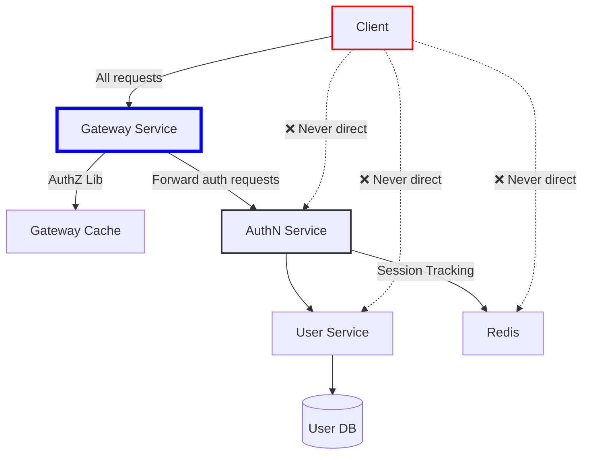

```mermaid
graph TD
    C[Client] -->|All requests| G[Gateway Service]
    G -->|AuthZ Lib| H[Gateway Cache]
    G -->|Forward auth requests| A[AuthN Service]
    A --> U[User Service]
    A -->|Session Tracking| R[Redis]
    U --> DB[(User DB)]

    %% Strict communication rules
    style C stroke:#ff0000,stroke-width:2px
    style G stroke:#0000ff,stroke-width:4px
    style A stroke:#333,stroke-width:2px

    %% No direct client-service paths
    C -.->|❌ Never direct| A
    C -.->|❌ Never direct| U
    C -.->|❌ Never direct| R
```