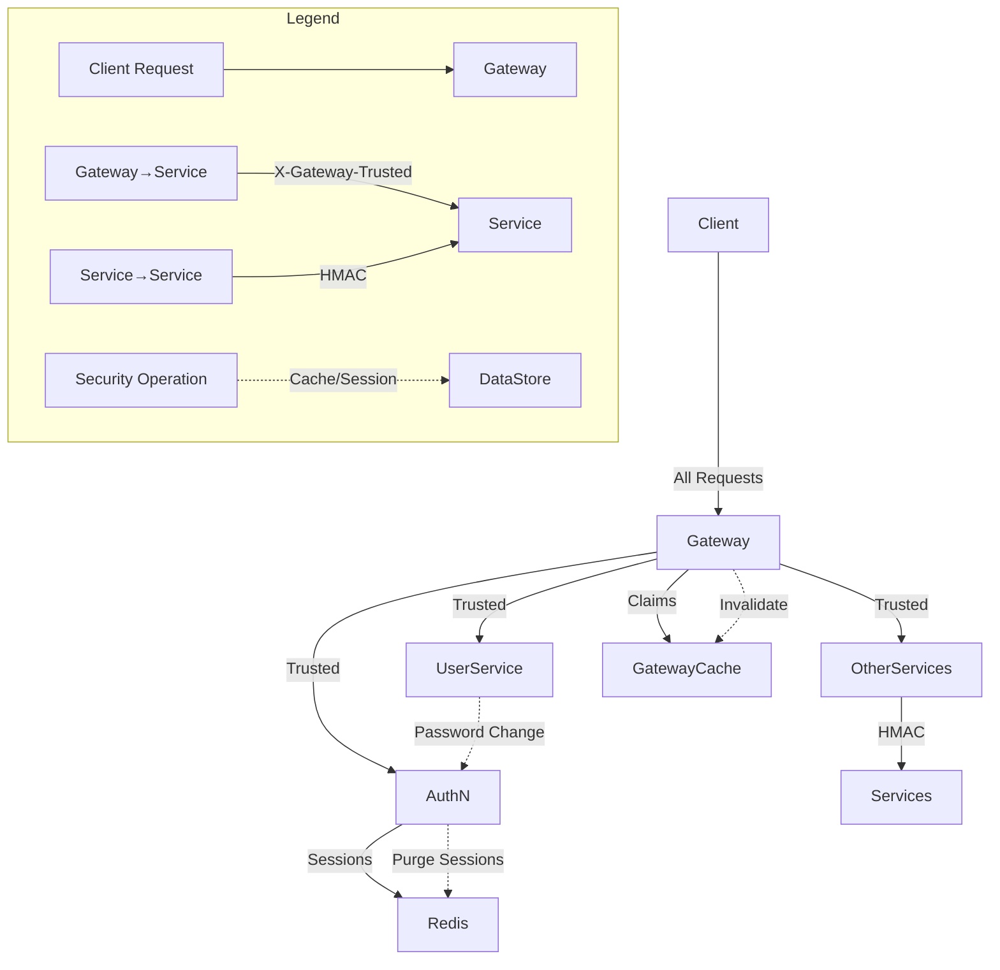

```mermaid
graph TD
    C[Client] -->|All Requests| G[Gateway]
    G -->|Trusted| A[AuthN]
    G -->|Trusted| U[UserService]
    G -->|Trusted| S[OtherServices]
    A -->|Sessions| R[Redis]
    G -->|Claims| H[GatewayCache]
    S -->|HMAC| OtherS[Services]

    %% Security Operations
    G -.->|Invalidate| H
    A -.->|Purge Sessions| R
    U -.->|Password Change| A

    %% Legend
    subgraph Legend
        ClientFlow[Client Request] --> Gateway
        TrustedFlow[Gateway→Service] -->|X-Gateway-Trusted| Service
        InternalAuth[Service→Service] -->|HMAC| Service
        SecurityOp[Security Operation] -.->|Cache/Session| DataStore
    end
```
