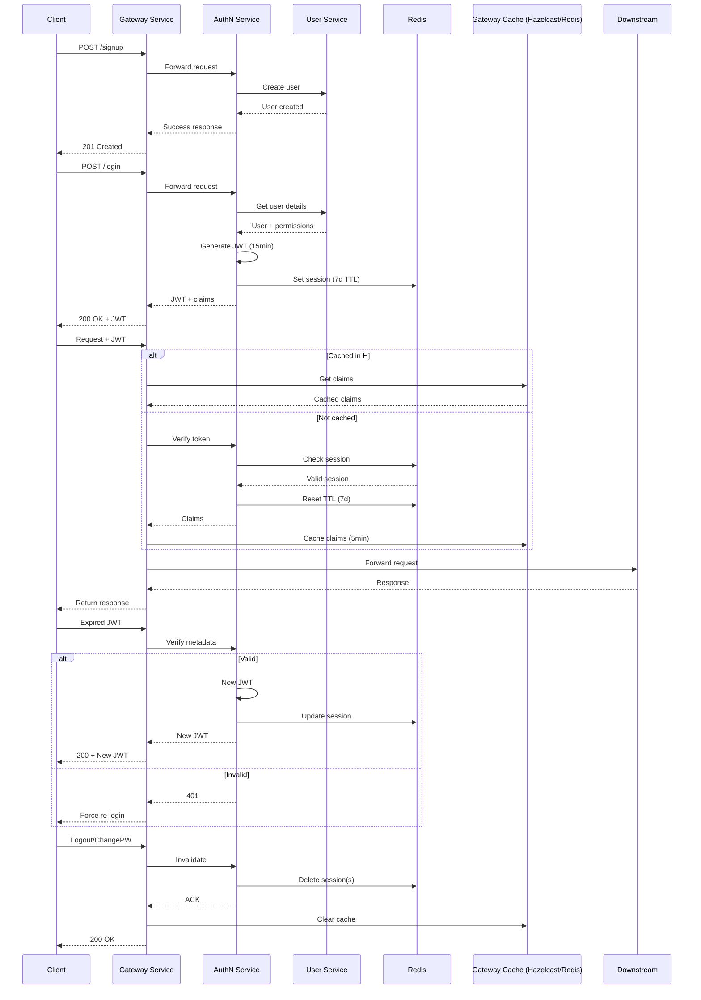

```mermaid
sequenceDiagram
    participant C as Client
    participant G as Gateway Service
    participant A as AuthN Service
    participant U as User Service
    participant R as Redis
    participant H as Gateway Cache (Hazelcast/Redis)

    %% Signup Flow
    C->>G: POST /signup
    G->>A: Forward request
    A->>U: Create user
    U-->>A: User created
    A-->>G: Success response
    G-->>C: 201 Created

    %% Login Flow
    C->>G: POST /login
    G->>A: Forward request
    A->>U: Get user details
    U-->>A: User + permissions
    A->>A: Generate JWT (15min)
    A->>R: Set session (7d TTL)
    A-->>G: JWT + claims
    G-->>C: 200 OK + JWT

    %% Regular Request Flow
    C->>G: Request + JWT
    alt Cached in H
        G->>H: Get claims
        H-->>G: Cached claims
    else Not cached
        G->>A: Verify token
        A->>R: Check session
        R-->>A: Valid session
        A->>R: Reset TTL (7d)
        A-->>G: Claims
        G->>H: Cache claims (5min)
    end
    G->>Downstream: Forward request
    Downstream-->>G: Response
    G-->>C: Return response

    %% Token Refresh
    C->>G: Expired JWT
    G->>A: Verify metadata
    alt Valid
        A->>A: New JWT
        A->>R: Update session
        A-->>G: New JWT
        G-->>C: 200 + New JWT
    else Invalid
        A-->>G: 401
        G-->>C: Force re-login
    end

    %% Logout/Password Change
    C->>G: Logout/ChangePW
    G->>A: Invalidate
    A->>R: Delete session(s)
    A-->>G: ACK
    G->>H: Clear cache
    G-->>C: 200 OK
```