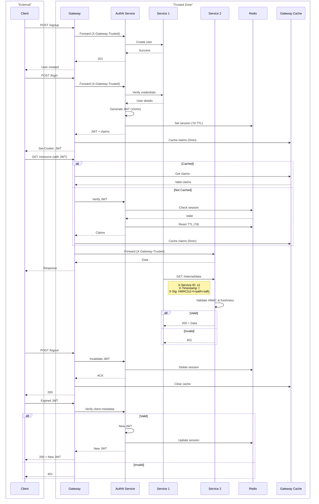

```mermaid
sequenceDiagram
    box "External"
        participant C as Client
    end
    box "Trusted Zone"
        participant G as Gateway
        participant A as AuthN Service
        participant S1 as Service 1
        participant S2 as Service 2
        participant R as Redis
        participant H as Gateway Cache
    end

    %% ===== CLIENT-FACING FLOWS =====
    %% Signup
    C->>G: POST /signup
    G->>A: Forward (X-Gateway-Trusted)
    A->>S1: Create user
    S1-->>A: Success
    A-->>G: 201
    G-->>C: User created

    %% Login
    C->>G: POST /login
    G->>A: Forward (X-Gateway-Trusted)
    A->>S1: Verify credentials
    S1-->>A: User details
    A->>A: Generate JWT (15min)
    A->>R: Set session (7d TTL)
    A-->>G: JWT + claims
    G->>H: Cache claims (5min)
    G-->>C: Set-Cookie: JWT

    %% Authenticated Request
    C->>G: GET /resource (with JWT)
    alt Cached
        G->>H: Get claims
        H-->>G: Valid claims
    else Not Cached
        G->>A: Verify JWT
        A->>R: Check session
        R-->>A: Valid
        A->>R: Reset TTL (7d)
        A-->>G: Claims
        G->>H: Cache claims (5min)
    end
    G->>S2: Forward (X-Gateway-Trusted)
    S2-->>G: Data
    G-->>C: Response

    %% ===== SERVICE-TO-SERVICE FLOWS =====
    S1->>S2: GET /internal/data
    Note right of S1: X-Service-ID: s1<br>X-Timestamp: t<br>X-Sig: HMAC(s1+t+path+salt)
    S2->>S2: Validate HMAC & freshness
    alt Valid
        S2-->>S1: 200 + Data
    else Invalid
        S2-->>S1: 401
    end

    %% ===== SECURITY OPERATIONS =====
    %% Logout
    C->>G: POST /logout
    G->>A: Invalidate JWT
    A->>R: Delete session
    A-->>G: ACK
    G->>H: Clear cache
    G-->>C: 200

    %% Token Refresh
    C->>G: Expired JWT
    G->>A: Verify client metadata
    alt Valid
        A->>A: New JWT
        A->>R: Update session
        A-->>G: New JWT
        G-->>C: 200 + New JWT
    else Invalid
        G-->>C: 401
    end
```
