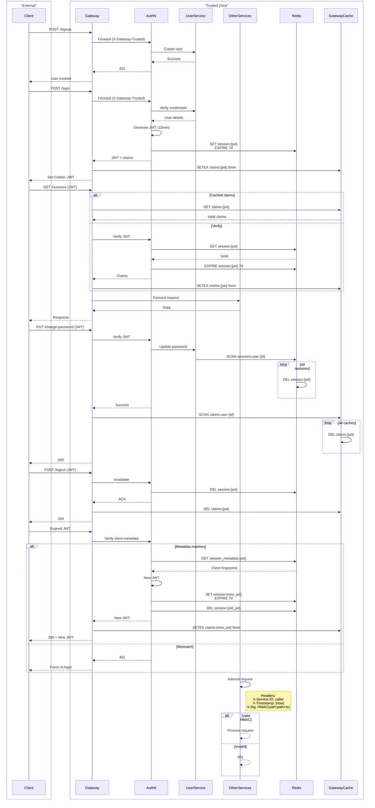

```mermaid
%% Complete Authentication/Authorization Flow
sequenceDiagram
    box "External"
        participant C as Client
    end
    box "Trusted Zone"
        participant G as Gateway
        participant A as AuthN
        participant U as UserService
        participant S as OtherServices
        participant R as Redis
        participant H as GatewayCache
    end

    %% ----- Core Flows -----
    %% 1. Signup
    C->>G: POST /signup
    G->>A: Forward (X-Gateway-Trusted)
    A->>U: Create user
    U-->>A: Success
    A-->>G: 201
    G-->>C: User created

    %% 2. Login
    C->>G: POST /login
    G->>A: Forward (X-Gateway-Trusted)
    A->>U: Verify credentials
    U-->>A: User details
    A->>A: Generate JWT (15min)
    A->>R: SET session:{jwt}<br>EXPIRE 7d
    A-->>G: JWT + claims
    G->>H: SETEX claims:{jwt} 5min
    G-->>C: Set-Cookie: JWT

    %% 3. Authenticated Request
    C->>G: GET /resource (JWT)
    alt Cached claims
        G->>H: GET claims:{jwt}
        H-->>G: Valid claims
    else Verify
        G->>A: Verify JWT
        A->>R: GET session:{jwt}
        R-->>A: Valid
        A->>R: EXPIRE session:{jwt} 7d
        A-->>G: Claims
        G->>H: SETEX claims:{jwt} 5min
    end
    G->>S: Forward request
    S-->>G: Data
    G-->>C: Response

    %% ----- Security Operations -----
    %% 4. Change Password
    C->>G: PUT /change-password (JWT)
    G->>A: Verify JWT
    A->>U: Update password
    U->>R: SCAN sessions:user:{id}
    loop All sessions
        R->>R: DEL session:{jwt}
    end
    A-->>G: Success
    G->>H: SCAN claims:user:{id}
    loop All caches
        H->>H: DEL claims:{jwt}
    end
    G-->>C: 200

    %% 5. Logout
    C->>G: POST /logout (JWT)
    G->>A: Invalidate
    A->>R: DEL session:{jwt}
    A-->>G: ACK
    G->>H: DEL claims:{jwt}
    G-->>C: 200

    %% 6. Token Refresh
    C->>G: Expired JWT
    G->>A: Verify client metadata
    alt Metadata matches
        A->>R: GET session_metadata:{jwt}
        R-->>A: Client fingerprint
        A->>A: New JWT
        A->>R: SET session:{new_jwt}<br>EXPIRE 7d
        A->>R: DEL session:{old_jwt}
        A-->>G: New JWT
        G->>H: SETEX claims:{new_jwt} 5min
        G-->>C: 200 + New JWT
    else Mismatch
        A-->>G: 401
        G-->>C: Force re-login
    end

    %% 7. Service-to-Service Auth
    S->>S: Internal request
    Note right of S: Headers:<br>X-Service-ID: caller<br>X-Timestamp: [now]<br>X-Sig: HMAC(salt+path+ts)
    alt Valid HMAC
        S-->>S: Process request
    else Invalid
        S-->>S: 401
    end
```
