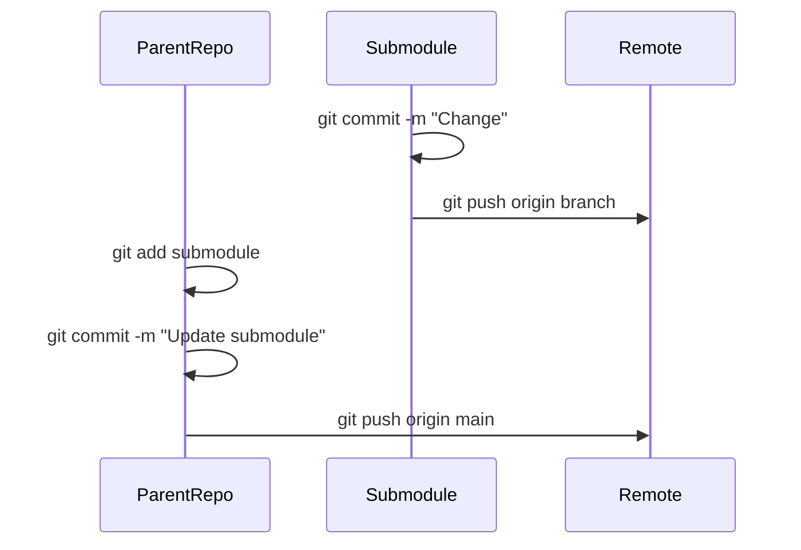

# microservices-orchestration

### **Process & Strategy for Committing to Git Submodules**

To effectively commit changes in submodules while maintaining synchronization with the parent repository, follow this structured approach:

---

### **1. **Make Changes in the Submodule**
```bash
cd path/to/submodule  # Navigate into the submodule directory
git checkout -b feature/your-change  # Create a new branch (recommended)
# Make your code changes...
```

---

### **2. **Commit Changes in the Submodule**
```bash
git add .
git commit -m "Your commit message"
git push origin feature/your-change  # Push to the submodule's remote
```

#### **Key Points**:
- Submodules are independent repositories. Commit here **first** before updating the parent repo.
- Use a branch to avoid detached HEAD state.

---

### **3. **Update the Parent Repository**
After committing/pushing the submodule changes:
```bash
cd ../..  # Return to the parent repo
git add path/to/submodule  # Stage the submodule's new commit hash
git commit -m "Update submodule to latest commit"
git push origin main  # Push parent repo's reference update
```

#### **What Happens**:
- The parent repo tracks the submodule's **commit hash**, not branches.
- Staging the submodule (`git add`) locks in the new commit.

---

### **4. **Sync Team Members**
Others must update both parent and submodules:
```bash
git pull  # Pull parent repo changes
git submodule update --init --recursive  # Sync submodules to new commits
```

---

### **5. **Handling Submodule Branches**
To track a branch (instead of a fixed commit):
1. **Update `.gitmodules`**:
   ```ini
   [submodule "submodule-name"]
       path = path/to/submodule
       url = https://github.com/user/repo.git
       branch = main  # Add this line
   ```
2. Sync:
   ```bash
   git submodule sync
   git submodule update --remote  # Pull latest from the branch
   ```

---

### **6. **Best Practices**
| Scenario | Command | Purpose |
|----------|---------|---------|
| **Submodule Development** | `cd submodule && git checkout -b feature` | Isolate changes in a branch. |
| **Update Parent Reference** | `git add submodule && git commit` | Lock in submodule's new commit. |
| **Pull Latest Submodule** | `git submodule update --remote` | Fetch branch-based updates. |
| **Recursive Clone** | `git clone --recurse-submodules` | Clone repo + submodules in one step. |

---

### **7. **Troubleshooting**
- **Detached HEAD?**  
  Run inside submodule:  
  ```bash
  git checkout main && git pull
  ```
- **Forgot to Commit Submodule First?**  
  Parent repo will reference an uncommitted submodule state. Fix:  
  ```bash
  cd submodule && git commit -m "Emergency fix" && cd ..
  git add submodule
  ```

---

### **Visual Workflow**


---

### **Key Takeaways**
1. **Commit in Submodule First**: Treat submodules as standalone repos.
2. **Then Update Parent**: The parent repo pins the submodule's commit.
3. **Track Branches Carefully**: Use `--remote` for dynamic updates.
4. **Communicate Changes**: Team members must run `git submodule update`.

This ensures clean, traceable history in both parent and submodule repos.